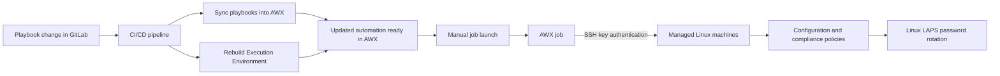

# Managing Linux machines with GitLab and AWX

**Environment:** Higher-education IT · Linux configuration and compliance

I keep playbooks in GitLab. When I change one, the CI/CD pipeline syncs it into AWX and rebuilds its Execution Environment. I launch the job manually, which gives me control over when a change reaches the machines.

## From a playbook change to a managed machine

## Automatic preparation, manual launch

The pipeline takes care of preparing the updated automation. It does not launch a job. I choose when to run it from AWX, keeping changes ready without immediately applying them across the lab.

## Central management over SSH

AWX connects to the managed machines using SSH key authentication. Ansible is agentless: the machines don't need a separate Ansible client installed to receive these changes. AWX initiates the connection and runs the work centrally.

This is how I apply configuration and compliance policies across the machines, including Linux LAPS password rotation.

## Keeping the runtime consistent

Custom Execution Environments provide the dependencies AWX jobs need. The playbooks describe the work; the Execution Environment provides the runtime used to carry it out.

## Proxmox has a separate role

Proxmox VE hosts golden images, the VMs we capture images from, and licensing servers. The GitLab-to-AWX pipeline handles the playbook workflow and ongoing machine management.

[Read about image preparation and lab deployments](lab-provisioning.md)
