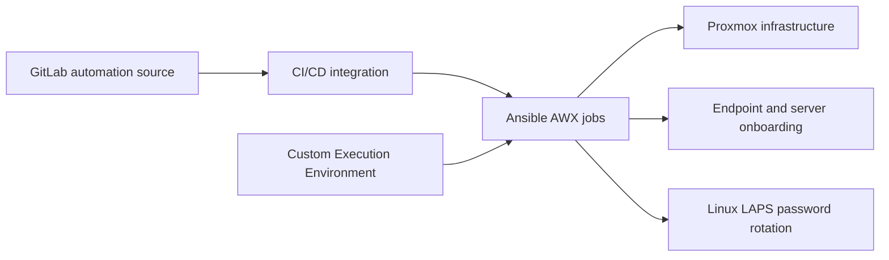

# Ansible AWX & Proxmox orchestration

**Environment:** Statler College IT  
**Focus:** GitLab-connected automation, endpoint/server onboarding, and credential lifecycle management

## Workflow

The CI/CD pipeline links GitLab to Ansible AWX for automated endpoint and server onboarding. Proxmox provides the virtualization environment, while custom Execution Environments package the dependencies used by automation jobs.

## Repeatable job execution

Custom Execution Environments give AWX jobs a defined runtime for their automation dependencies. This makes the execution environment part of the deployment design, alongside the playbooks and inventory.

## Onboarding and orchestration

The GitLab-to-AWX connection supports a repeatable path from automation source to onboarding jobs. The exact trigger mechanism, inventory source, and Proxmox job sequence remain to be documented from the implementation.

## Linux LAPS

Linux LAPS password rotation addresses the lifecycle of local administrative credentials. Rotation cadence, secret storage, recovery access, and failure handling are implementation details to describe using sanitized examples; no credentials belong in portfolio artifacts.

## Supporting evidence

Add a redacted successful job record, an Execution Environment dependency manifest, and a sanitized onboarding workflow when available. No separate performance metric was supplied for this system.

[See the OS provisioning case study](lab-provisioning.md)
