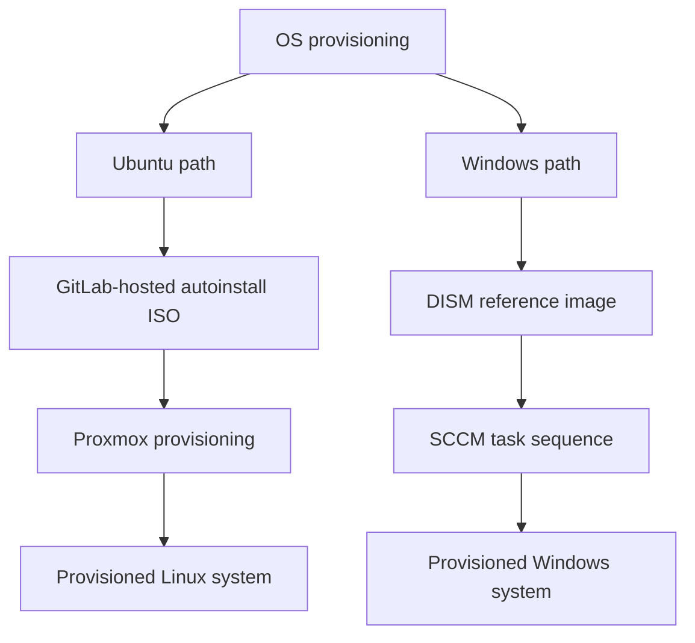

# CI/CD lab provisioning

**Environment:** Statler College IT  
**Outcome:** OS deployment time reduced from **3 hours to 25 minutes**—155 minutes saved per deployment, approximately an 86% reduction.

## The provisioning workflow

The work combined GitLab-hosted Ubuntu autoinstall ISOs, Proxmox, and Windows DISM reference images deployed through SCCM task sequences. These platforms support separate Linux and Windows provisioning paths within the broader lab deployment workflow.

## Ubuntu autoinstall and Proxmox

Ubuntu autoinstall moves installation choices into a repeatable configuration. GitLab-hosted ISOs supply the installation media for the Proxmox workflow, reducing repeated manual setup during lab provisioning.

## Windows reference images

DISM reference images provide the Windows baseline. SCCM task sequences coordinate deployment steps so that provisioning follows a repeatable process rather than a workstation-by-workstation installation.

## Operational result

The reported deployment duration fell from 180 to 25 minutes. This measures elapsed deployment time; it does not independently establish administrator touch time or annual labor savings. Measurement conditions and image-version details can be added alongside future deployment records.

## From provisioning to onboarding

Provisioning creates the initial system. The related [Ansible AWX and Proxmox orchestration workflow](awx-orchestration.md) addresses automated endpoint and server onboarding.
