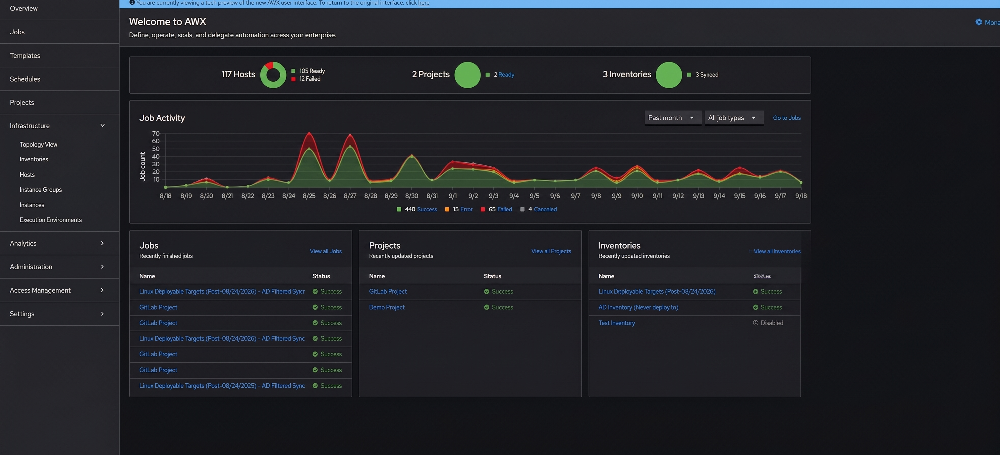
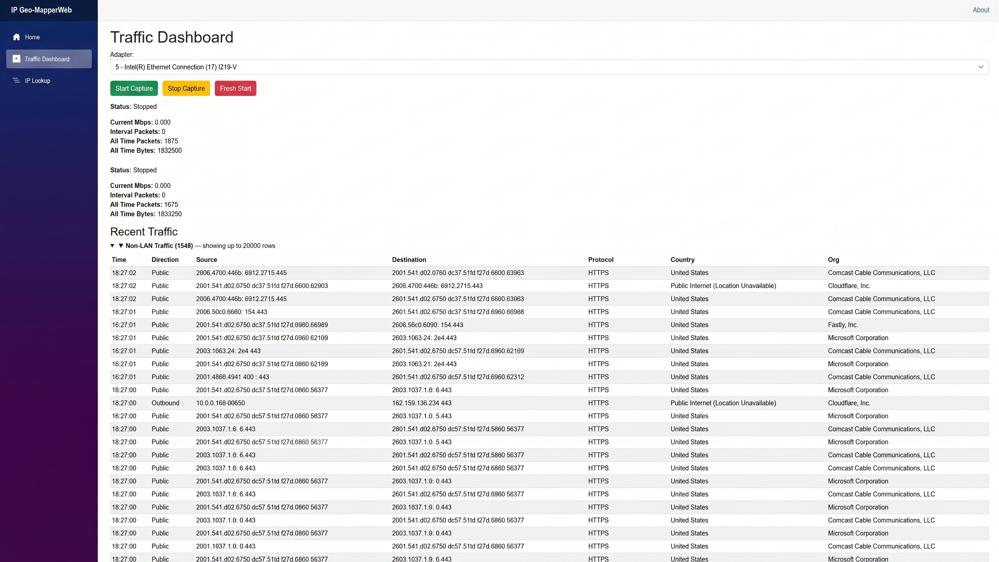

<section class="hero" markdown>

SYSTEMS / NETWORKS / AUTOMATIONWVU · Management Information Systems

# Behind the scenes. Ahead of the busywork.

I work on the systems people depend on: Windows and Linux labs, network infrastructure, and the automation that makes everyday work a little easier.

[See the work ↓](#selected-work){ .button }
[Meet the person behind it ↗](about.md){ .text-link }

01 / IN THE ENVIRONMENTLinux management with AWX ↗

</section>

<section class="results" aria-label="Results from my infrastructure work">

LESS WAITING
60s → 10s

Linux domain login time

FASTER STARTS
3–5 min

Until lab deployment task sequences start

REAL ENVIRONMENTS
100 machines

Ubuntu workstations in the login optimization work

</section>

<section class="selected-work" markdown>

A LOOK INSIDE

## Selected work { #selected-work }

Practical improvements, networking labs, and things I've built to learn.

[{ loading=lazy }](projects/gns3-network.md)

01 / NETWORKING

### A network, from the ground up

VLANs, routing, and subnet isolation in a Cisco IOS lab. A place to put networking concepts to work.

[Inside the GNS3 lab ↗](projects/gns3-network.md){ .text-link }

[{ loading=lazy }](projects/ip-geo-mapper.md)

02 / A SIDE PROJECT

### A closer look at network traffic

IP-Geo-Mapper is a C# and Blazor project for exploring captured traffic, IP locations, and ports.

[About IP-Geo-Mapper ↗](projects/ip-geo-mapper.md){ .text-link }

</section>

<section class="field-notes" markdown>

EVERYDAY ENGINEERING

## Small changes. Noticeable differences.

Some of my most useful work happens behind a login screen or before a lab opens. These are notes from that work.

[01 / DEPLOYMENT<strong>Starting a whole lab in minutes</strong>Image preparation, device collections, and task sequences. ↗](engineering/lab-provisioning.md)

[02 / AUTOMATION<strong>From GitLab to managed machines</strong>Playbooks, execution environments, and AWX. ↗](engineering/awx-orchestration.md)

[03 / LINUX<strong>Taking the wait out of domain logins</strong>SSSD tuning across 100 Ubuntu workstations. ↗](engineering/sssd-tuning.md)

</section>

<section class="toolkit" markdown>

TOOLS I WORK WITH

Linux / Windows Server / Ansible AWX / Proxmox / Cisco IOS / PowerShell / Python / C#

[CompTIA Network+ · CCNA in progress](certifications.md){ .text-link }

</section>
