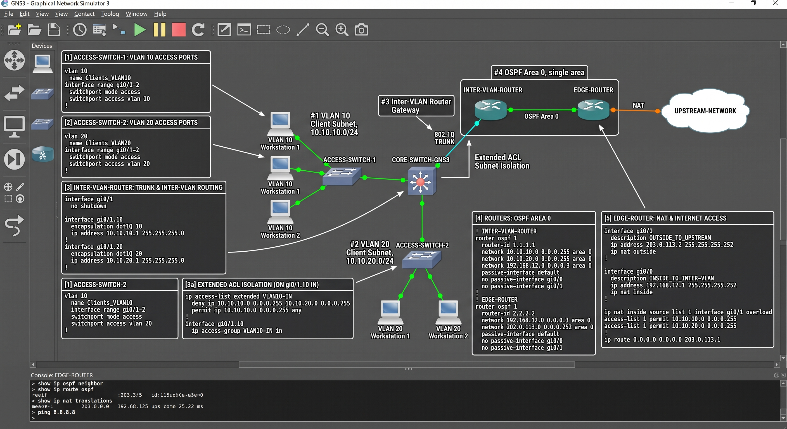

# GNS3 enterprise network

**Focus:** Cisco IOS routing, switching, and subnet isolation  
**Scope:** Single-area OSPF (Area 0), 802.1Q trunking, inter-VLAN routing, NAT, and extended ACLs

## Topology overview

The lab combines VLAN segmentation with routed connectivity and controlled external access. The annotated image below shows the layout and configuration concepts.

<figure class="project-figure" markdown>

[{ loading=lazy }](../assets/images/gns3.jpg)

<figcaption>Network layout with routing and switching annotations. The configuration examples below remain illustrative. Select the image to view it full size.</figcaption>
</figure>

## Routing and segmentation

- **OSPF:** Area 0 provides dynamic routing between participating routers. This write-up covers single-area routing; additional OSPF areas are not established by the supplied project details.
- **802.1Q trunks:** VLAN tags carry multiple logical networks across a shared switch-to-router link.
- **Inter-VLAN routing:** Layer 3 interfaces provide gateways between the VLAN subnets.
- **NAT:** Address translation supports access from internal lab networks to the upstream network.
- **Extended ACLs:** Source and destination subnet rules enforce isolation between selected VLANs.

## Representative Cisco IOS configurations

These are illustrative examples using private lab addresses, not recovered or sanitized exports of the actual running configuration. Interface names, addressing, and policy must be matched to the real topology.

### Area 0 OSPF

```cisco
router ospf 1
 router-id 10.255.0.1
 passive-interface default
 no passive-interface GigabitEthernet0/1
 network 10.10.10.0 0.0.0.255 area 0
 network 10.10.20.0 0.0.0.255 area 0
 network 10.255.0.0 0.0.0.3 area 0
```

The example advertises two client subnets and a transit network. Client-facing interfaces remain passive; the transit interface can form an adjacency.

### Extended ACL subnet isolation

```cisco
ip access-list extended VLAN10-IN
 deny ip 10.10.10.0 0.0.0.255 10.10.20.0 0.0.0.255
 permit ip 10.10.10.0 0.0.0.255 any
!
interface GigabitEthernet0/0.10
 encapsulation dot1Q 10
 ip address 10.10.10.1 255.255.255.0
 ip access-group VLAN10-IN in
```

This example blocks traffic entering from VLAN 10 toward VLAN 20 and permits other IP destinations from VLAN 10. It is a directional, stateless rule; reciprocal isolation requires a corresponding policy on the other ingress path.

## Validation checklist

Record OSPF neighbors and learned routes, verify trunk VLAN membership, test each VLAN gateway, inspect NAT translations for upstream traffic, and check ACL counters during allowed and denied connectivity tests. Actual command output and running-config excerpts remain to be attached.
