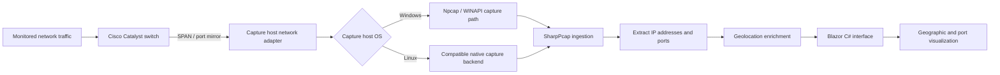

# IP-Geo-Mapper

[View Source on GitHub](https://github.com/bpf00010/IP-Geo-Mapper){ .md-button .md-button--primary }

!!! info "Live demo"
    The source repository is linked above. A separate hosted application URL has not yet been confirmed.

**Focus:** Packet capture, network observability, and cross-platform visualization  
**Stack:** C# · Blazor · SharpPcap · Npcap · Cisco Catalyst

## Overview

IP-Geo-Mapper turns mirrored network traffic into geographic and transport-port context. It brings packet ingestion and visualization together in a C# application, providing a way to explore the endpoints visible on a monitored network segment.

## Architecture

### 1. Mirror the traffic

A Cisco Catalyst switch mirrors selected traffic to a capture-facing interface using SPAN. This supplies the capture host with copies of traffic from the monitored source ports or VLANs.

### 2. Capture and parse

SharpPcap provides the application-facing packet capture layer. The Windows capture path uses Npcap and the project's described WINAPI mode. The application extracts IP and transport-port information for downstream visualization.

Npcap is the Windows component; a Linux capture host needs a compatible native backend. The exact Linux capture configuration and meaning of the project's WINAPI setting should be confirmed against the implementation before publishing setup instructions.

### 3. Add geographic context

IP information is enriched with geolocation data and paired with port information. The geolocation provider, lookup behavior, and handling of private or unresolved addresses are implementation details still to document. A mapped IP location represents network-location context, rather than a precise device location.

### 4. Visualize in Blazor

The cross-platform Blazor UI presents the geographic and port data in one interface. The diagram separates the OS-specific capture components from the C# processing and presentation layers.

## Engineering considerations

A complete validation record should cover mirrored traffic visibility, capture permissions, packet loss under load, and behavior when geolocation is unavailable. SPAN configuration determines which traffic reaches the application; the map can only represent the traffic observed by that capture path.

## Project evidence

The live URL, screenshots, capture-mode details, and performance measurements remain to be added. This case study describes the supplied architecture without asserting unverified throughput or coverage results.
