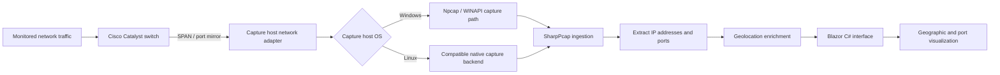

# IP-Geo-Mapper

[View Source on GitHub](https://github.com/bpf00010/IP-Geo-Mapper){ .md-button .md-button--primary }

!!! info "Live demo"
    The source repository is linked above. A separate hosted application URL has not yet been confirmed.

**Focus:** Packet capture, network observability, and cross-platform visualization  
**Stack:** C# · Blazor · SharpPcap · Npcap · Cisco Catalyst

## Overview

I built IP-Geo-Mapper to get a clearer view of the traffic on a network segment. It takes captured packets, extracts IP addresses and ports, and brings that information into a geographic view in Blazor.

## Architecture

### 1. Mirror the traffic

A Cisco Catalyst switch mirrors selected traffic to a capture-facing interface using SPAN. This supplies the capture host with copies of traffic from the monitored source ports or VLANs.

### 2. Capture and parse

SharpPcap provides the application-facing packet capture layer. The Windows capture path uses Npcap and the project's described WINAPI mode. The application extracts IP and transport-port information for downstream visualization.

Npcap is the Windows component; a Linux capture host needs a compatible native backend. Platform-specific setup instructions are still being documented.

### 3. Add geographic context

IP information is enriched with geolocation data and paired with port information. A mapped IP location represents network-location context, rather than a precise device location.

### 4. Visualize in Blazor

The cross-platform Blazor UI presents the geographic and port data in one interface. The diagram separates the OS-specific capture components from the C# processing and presentation layers.

## Engineering considerations

The capture is only as useful as the traffic reaching it. The switch's SPAN configuration determines what the application sees, and missing geolocation data can leave an address without a useful map location.

## Source code

[Browse IP-Geo-Mapper on GitHub](https://github.com/bpf00010/IP-Geo-Mapper).
